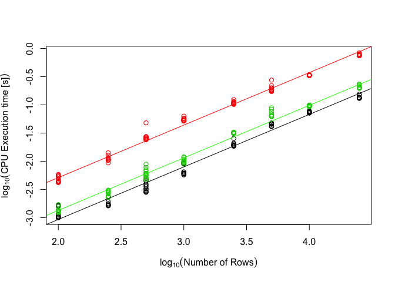

# Scalability Evaluation
{: .no_toc }

## Table of contents
{: .no_toc .text-delta }

1. TOC
{:toc}

Scalability of isa4J was assessed and compared to the python isatools API in two dimensions: number of entries and complexity of entries.

At the simplest complexity (*minimum*) rows consisted only of a Source connected to a Sample through a Process in the Study File, and that Sample connected to a DataFile through another Process in the Assay File, with no Characteristics, Comments, or other additional Information.
At the second level of complexity (*reduced*), a Characteristic was added to the Sample in the Study File, and the Assay File was expanded to Sample->Process->Material->Process->DataFile.
The third and final level of complexity (*real world*) was modelled after the real-world metadata published for a plant phenotyping experiment that conform to the MIAPPE v1.1 data standard ([link](https://doi.ipk-gatersleben.de/DOI/1c0c2b3e-7478-48b1-81f6-47981f44a5cb/8a37f290-e7d3-45de-90eb-2e3f0106e574/0/1847940088)).
Examplary ISA-Tab output for each of the three complexity levels can be found in the following section.

For each complexity level, CPU execution time was measured for writing a number of $n$ rows in Study and Assay File each, starting at 1 row and increasing stepwise up to 25,000 rows.
Every combination of complexity level and $n$ was measured for 5 consecutive runs (12 for isa4J because results varied more) after a warm-up of writing 100 rows.
Additionally, memory usage was measured for realistic complexity in 5 separate runs after CPU execution time measurements.

Performance evaluation was carried out on a Macbook Pro 2017 (2.3 GHz Dual-Core Intel Core i5 Processor, 16 GB 2133 MHz LPDDR3 RAM) with macOS Catalina (Version 10.15.2).
isatools was evaluated under Python 3.7.3 [Clang 11.0.0 (clang-1100.0.33.16)] using isatools version 0.11 and memory-profiler version 0.57 for measuring RAM usage. CPU execution time was measured with `time.process_time_ns`. 
isa4J was evaluated under AdoptOpenJDK 11.0.5 using `ThreadMXBean.getCurrentThreadCpuTime()` and `MemoryMXBean.getHeapMemory().getUsed() + MemoryMXBean.getNonHeapMemory().getUsed()`.

The actual code generating the files and measuring time and memory usage can be found [here](https://github.com/IPK-BIT/isa4J/blob/master/src/test/resources/de/ipk_gatersleben/bit/bi/isa4j/performanceTests/isatools_performance_test.py) for python isatools and [here](https://github.com/IPK-BIT/isa4J/blob/master/src/test/java/de/ipk_gatersleben/bit/bi/isa4j/performanceTests/PerformanceTester.java) for isa4J

## Complexity Levels

Here you can see what the output generated for the different complexity level looks like.
It is identical between isa4J and python isatools.

### Minimal

Study File:

Source Name         Protocol REF        Sample Name       
------------------  ------------------  ------------------
source_material-0   sample collection   sample_material-0 
source_material-1   sample collection   sample_material-1 
source_material-2   sample collection   sample_material-2 
source_material-3   sample collection   sample_material-3 

Assay File:

Sample Name         Protocol REF          Raw Data File    
------------------  --------------------  -----------------
sample_material-0   material sequencing   sequenced-data-0 
sample_material-1   material sequencing   sequenced-data-1 
sample_material-2   material sequencing   sequenced-data-2 
sample_material-3   material sequencing   sequenced-data-3 

### Minimal

Study File:

Source Name         Protocol REF        Sample Name         Characteristics[Organism]   Term Source REF   Term Accession Number                               
------------------  ------------------  ------------------  --------------------------  ----------------  ----------------------------------------------------
source_material-0   sample collection   sample_material-0   Homo Sapiens                NCBITaxon         http://purl.bioontology.org/ontology/NCBITAXON/9606 
source_material-1   sample collection   sample_material-1   Homo Sapiens                NCBITaxon         http://purl.bioontology.org/ontology/NCBITAXON/9606 
source_material-2   sample collection   sample_material-2   Homo Sapiens                NCBITaxon         http://purl.bioontology.org/ontology/NCBITAXON/9606 
source_material-3   sample collection   sample_material-3   Homo Sapiens                NCBITaxon         http://purl.bioontology.org/ontology/NCBITAXON/9606 

Assay File:

Sample Name         Protocol REF   Extract Name   Protocol REF   Raw Data File    
------------------  -------------  -------------  -------------  -----------------
sample_material-0   extraction     extract-0      sequencing     sequenced-data-0 
sample_material-1   extraction     extract-1      sequencing     sequenced-data-1 
sample_material-2   extraction     extract-2      sequencing     sequenced-data-2 
sample_material-3   extraction     extract-3      sequencing     sequenced-data-3 

### Real World

Study File:

Source Name   Characteristics[Organism]   Term Source REF   Term Accession Number                           Characteristics[Genus]   Term Source REF   Term Accession Number                           Characteristics[Species]   Characteristics[Infraspecific Name]    Characteristics[Biological Material Latitude]   Characteristics[Biological Material Longitude]  Characteristics[Material Source ID]                                                  Characteristics[Seed Origin]                      Characteristics[Growth Facility]    Characteristics[Material Source Latitude]   Characteristics[Material Source Longitude]  Protocol REF   Parameter Value[Rooting medium]                                                     Parameter Value[Container type]   Term Source REF   Term Accession Number                           Parameter Value[Container volume]  Unit    Term Source REF   Term Accession Number                        Parameter Value[Container height]  Unit   Term Source REF   Term Accession Number                        Parameter Value[Number of plants per containers]   Parameter Value[pH]   Parameter Value[Air temperature Day - Stratification]  Unit   Term Source REF   Term Accession Number                        Parameter Value[Air temperature Night - Stratification]  Unit   Term Source REF   Term Accession Number                        Parameter Value[Average length of the light period - Stratification]  Unit   Term Source REF   Term Accession Number                        Parameter Value[Light intensity - Stratification]  Unit            Parameter Value[Fraction of outside light intercepted by growth facility components and surrounding structures - Stratification]  Parameter Value[Type of lamps used]                                                                       Parameter Value[Average relative humidity during the light period - Stratification]  Unit   Term Source REF   Term Accession Number                        Parameter Value[Average relative humidity during the dark period - Stratification]  Unit   Term Source REF   Term Accession Number                        Parameter Value[Air temperature Day - Germination]  Unit   Term Source REF   Term Accession Number                        Parameter Value[Air temperature Night - Germination]  Unit   Term Source REF   Term Accession Number                        Parameter Value[Average length of the light period - Germination]  Unit   Term Source REF   Term Accession Number                        Parameter Value[Light intensity - Germination]  Unit            Parameter Value[Fraction of outside light intercepted by growth facility components and surrounding structures - Germination]   Parameter Value[Average relative humidity during the light period - Germination]  Unit   Term Source REF   Term Accession Number                        Parameter Value[Average relative humidity during the dark period - Germination]  Unit   Term Source REF   Term Accession Number                        Parameter Value[Air temperature Day - Post Germination]  Unit   Term Source REF   Term Accession Number                        Parameter Value[Air temperature Night - Post Germination]  Unit   Term Source REF   Term Accession Number                        Parameter Value[Average length of the light period - Post Germination]  Unit   Term Source REF   Term Accession Number                        Parameter Value[Light intensity - Post Germination]  Unit            Parameter Value[Fraction of outside light intercepted by growth facility components and surrounding structures - Post Germination]   Parameter Value[Average relative humidity during the light period - Post Germination]  Unit   Term Source REF   Term Accession Number                        Parameter Value[Average relative humidity during the dark period - Post Germination]  Unit   Term Source REF   Term Accession Number                       Parameter Value[Watering regimen]                                      Parameter Value[Composition of nutrient solutions used for irrigation]   Sample Name   Characteristics[Observation Unit Type]   Factor Value[Soil Cover]   Factor Value[Plant Movement] 
------------  --------------------------  ----------------  ----------------------------------------------  -----------------------  ----------------  ----------------------------------------------  -------------------------  ------------------------------------  ----------------------------------------------  -----------------------------------------------  -----------------------------------------------------------------------------------  ------------------------------------------------  ---------------------------------  ------------------------------------------  -------------------------------------------  -------------  ----------------------------------------------------------------------------------  --------------------------------  ----------------  ---------------------------------------------  ----------------------------------  ------  ----------------  ------------------------------------------  ----------------------------------  -----  ----------------  ------------------------------------------  -------------------------------------------------  --------------------  ------------------------------------------------------  -----  ----------------  ------------------------------------------  --------------------------------------------------------  -----  ----------------  ------------------------------------------  ---------------------------------------------------------------------  -----  ----------------  ------------------------------------------  --------------------------------------------------  -------------  ---------------------------------------------------------------------------------------------------------------------------------  -------------------------------------------------------------------------------------------------------  ------------------------------------------------------------------------------------  -----  ----------------  ------------------------------------------  -----------------------------------------------------------------------------------  -----  ----------------  ------------------------------------------  ---------------------------------------------------  -----  ----------------  ------------------------------------------  -----------------------------------------------------  -----  ----------------  ------------------------------------------  ------------------------------------------------------------------  -----  ----------------  ------------------------------------------  -----------------------------------------------  -------------  ------------------------------------------------------------------------------------------------------------------------------  ---------------------------------------------------------------------------------  -----  ----------------  ------------------------------------------  --------------------------------------------------------------------------------  -----  ----------------  ------------------------------------------  --------------------------------------------------------  -----  ----------------  ------------------------------------------  ----------------------------------------------------------  -----  ----------------  ------------------------------------------  -----------------------------------------------------------------------  -----  ----------------  ------------------------------------------  ----------------------------------------------------  -------------  -----------------------------------------------------------------------------------------------------------------------------------  --------------------------------------------------------------------------------------  -----  ----------------  ------------------------------------------  -------------------------------------------------------------------------------------  -----  ----------------  ------------------------------------------  ---------------------------------------------------------------------  -----------------------------------------------------------------------  ------------  ---------------------------------------  -------------------------  -----------------------------
Plant_0       Arabidopsis thaliana        NCBITaxon         http://purl.obolibrary.org/obo/NCBITaxon_3702   Arabidopsis              NCBITaxon         http://purl.obolibrary.org/obo/NCBITaxon_3701   thaliana                   NA                                                                          51.82772                                         11.27778  http://eurisco.ipk-gatersleben.de/apex/f?p=103:16:::NO::P16_EURISCO_ACC_ID:1668187   http://arabidopsis.info/StockInfo?NASC_id=22680   small LemnaTec phytochamber                                          51.82772                                     11.27778  Growth         85% (v) red substrate 1 (Klasmann-Deilmann GmbH, Geeste, Germany) / 15% (v) sand)   pot                               AGRO              http://purl.obolibrary.org/obo/AGRO_00000309                                 0.43  litre   UO                http://purl.obolibrary.org/obo/UO_0000099                                 0.08  m      UO                http://purl.obolibrary.org/obo/UO_0000008                                                   1                   5.5                                                       5  s      UO                http://purl.obolibrary.org/obo/UO_0000027                                                          5  °C     UO                http://purl.obolibrary.org/obo/UO_0000027                                                                      24  h      UO                http://purl.obolibrary.org/obo/UO_0000032                                                    0  µmol m-2 s-1                                                                                                                                   0  Whitelux Plus metal halide lamps (Venture Lighting Europe Ltd., Rickmansworth, Hertfordshire, England)                                                                                     90  %      UO                http://purl.obolibrary.org/obo/UO_0000187                                                                                    90  %      UO                http://purl.obolibrary.org/obo/UO_0000187                                                    16  °C     UO                http://purl.obolibrary.org/obo/UO_0000027                                                      14  °C     UO                http://purl.obolibrary.org/obo/UO_0000027                                                                   16  h      UO                http://purl.obolibrary.org/obo/UO_0000032                                               140  µmol m-2 s-1                                                                                                                                0                                                                                 75  %      UO                http://purl.obolibrary.org/obo/UO_0000187                                                                                 75  %      UO                http://purl.obolibrary.org/obo/UO_0000187                                                         20  °C     UO                http://purl.obolibrary.org/obo/UO_0000027                                                           18  °C     UO                http://purl.obolibrary.org/obo/UO_0000027                                                                        16  h      UO                http://purl.obolibrary.org/obo/UO_0000032                                                    140  µmol m-2 s-1                                                                                                                                     0                                                                                      60  %      UO                http://purl.obolibrary.org/obo/UO_0000187                                                                                      60  %      UO                http://purl.obolibrary.org/obo/UO_0000187   initial watering before germination from bottom, then top irrigation   water                                                                    1135FA-0      plant                                    covered                    rotating                     
Plant_1       Arabidopsis thaliana        NCBITaxon         http://purl.obolibrary.org/obo/NCBITaxon_3702   Arabidopsis              NCBITaxon         http://purl.obolibrary.org/obo/NCBITaxon_3701   thaliana                   NA                                                                          51.82772                                         11.27778  http://eurisco.ipk-gatersleben.de/apex/f?p=103:16:::NO::P16_EURISCO_ACC_ID:1668187   http://arabidopsis.info/StockInfo?NASC_id=22680   small LemnaTec phytochamber                                          51.82772                                     11.27778  Growth         85% (v) red substrate 1 (Klasmann-Deilmann GmbH, Geeste, Germany) / 15% (v) sand)   pot                               AGRO              http://purl.obolibrary.org/obo/AGRO_00000309                                 0.43  litre   UO                http://purl.obolibrary.org/obo/UO_0000099                                 0.08  m      UO                http://purl.obolibrary.org/obo/UO_0000008                                                   1                   5.5                                                       5  s      UO                http://purl.obolibrary.org/obo/UO_0000027                                                          5  °C     UO                http://purl.obolibrary.org/obo/UO_0000027                                                                      24  h      UO                http://purl.obolibrary.org/obo/UO_0000032                                                    0  µmol m-2 s-1                                                                                                                                   0  Whitelux Plus metal halide lamps (Venture Lighting Europe Ltd., Rickmansworth, Hertfordshire, England)                                                                                     90  %      UO                http://purl.obolibrary.org/obo/UO_0000187                                                                                    90  %      UO                http://purl.obolibrary.org/obo/UO_0000187                                                    16  °C     UO                http://purl.obolibrary.org/obo/UO_0000027                                                      14  °C     UO                http://purl.obolibrary.org/obo/UO_0000027                                                                   16  h      UO                http://purl.obolibrary.org/obo/UO_0000032                                               140  µmol m-2 s-1                                                                                                                                0                                                                                 75  %      UO                http://purl.obolibrary.org/obo/UO_0000187                                                                                 75  %      UO                http://purl.obolibrary.org/obo/UO_0000187                                                         20  °C     UO                http://purl.obolibrary.org/obo/UO_0000027                                                           18  °C     UO                http://purl.obolibrary.org/obo/UO_0000027                                                                        16  h      UO                http://purl.obolibrary.org/obo/UO_0000032                                                    140  µmol m-2 s-1                                                                                                                                     0                                                                                      60  %      UO                http://purl.obolibrary.org/obo/UO_0000187                                                                                      60  %      UO                http://purl.obolibrary.org/obo/UO_0000187   initial watering before germination from bottom, then top irrigation   water                                                                    1135FA-1      plant                                    uncovered                  stationary                   
Plant_2       Arabidopsis thaliana        NCBITaxon         http://purl.obolibrary.org/obo/NCBITaxon_3702   Arabidopsis              NCBITaxon         http://purl.obolibrary.org/obo/NCBITaxon_3701   thaliana                   NA                                                                          51.82772                                         11.27778  http://eurisco.ipk-gatersleben.de/apex/f?p=103:16:::NO::P16_EURISCO_ACC_ID:1668187   http://arabidopsis.info/StockInfo?NASC_id=22680   small LemnaTec phytochamber                                          51.82772                                     11.27778  Growth         85% (v) red substrate 1 (Klasmann-Deilmann GmbH, Geeste, Germany) / 15% (v) sand)   pot                               AGRO              http://purl.obolibrary.org/obo/AGRO_00000309                                 0.43  litre   UO                http://purl.obolibrary.org/obo/UO_0000099                                 0.08  m      UO                http://purl.obolibrary.org/obo/UO_0000008                                                   1                   5.5                                                       5  s      UO                http://purl.obolibrary.org/obo/UO_0000027                                                          5  °C     UO                http://purl.obolibrary.org/obo/UO_0000027                                                                      24  h      UO                http://purl.obolibrary.org/obo/UO_0000032                                                    0  µmol m-2 s-1                                                                                                                                   0  Whitelux Plus metal halide lamps (Venture Lighting Europe Ltd., Rickmansworth, Hertfordshire, England)                                                                                     90  %      UO                http://purl.obolibrary.org/obo/UO_0000187                                                                                    90  %      UO                http://purl.obolibrary.org/obo/UO_0000187                                                    16  °C     UO                http://purl.obolibrary.org/obo/UO_0000027                                                      14  °C     UO                http://purl.obolibrary.org/obo/UO_0000027                                                                   16  h      UO                http://purl.obolibrary.org/obo/UO_0000032                                               140  µmol m-2 s-1                                                                                                                                0                                                                                 75  %      UO                http://purl.obolibrary.org/obo/UO_0000187                                                                                 75  %      UO                http://purl.obolibrary.org/obo/UO_0000187                                                         20  °C     UO                http://purl.obolibrary.org/obo/UO_0000027                                                           18  °C     UO                http://purl.obolibrary.org/obo/UO_0000027                                                                        16  h      UO                http://purl.obolibrary.org/obo/UO_0000032                                                    140  µmol m-2 s-1                                                                                                                                     0                                                                                      60  %      UO                http://purl.obolibrary.org/obo/UO_0000187                                                                                      60  %      UO                http://purl.obolibrary.org/obo/UO_0000187   initial watering before germination from bottom, then top irrigation   water                                                                    1135FA-2      plant                                    covered                    rotating                     
Plant_3       Arabidopsis thaliana        NCBITaxon         http://purl.obolibrary.org/obo/NCBITaxon_3702   Arabidopsis              NCBITaxon         http://purl.obolibrary.org/obo/NCBITaxon_3701   thaliana                   NA                                                                          51.82772                                         11.27778  http://eurisco.ipk-gatersleben.de/apex/f?p=103:16:::NO::P16_EURISCO_ACC_ID:1668187   http://arabidopsis.info/StockInfo?NASC_id=22680   small LemnaTec phytochamber                                          51.82772                                     11.27778  Growth         85% (v) red substrate 1 (Klasmann-Deilmann GmbH, Geeste, Germany) / 15% (v) sand)   pot                               AGRO              http://purl.obolibrary.org/obo/AGRO_00000309                                 0.43  litre   UO                http://purl.obolibrary.org/obo/UO_0000099                                 0.08  m      UO                http://purl.obolibrary.org/obo/UO_0000008                                                   1                   5.5                                                       5  s      UO                http://purl.obolibrary.org/obo/UO_0000027                                                          5  °C     UO                http://purl.obolibrary.org/obo/UO_0000027                                                                      24  h      UO                http://purl.obolibrary.org/obo/UO_0000032                                                    0  µmol m-2 s-1                                                                                                                                   0  Whitelux Plus metal halide lamps (Venture Lighting Europe Ltd., Rickmansworth, Hertfordshire, England)                                                                                     90  %      UO                http://purl.obolibrary.org/obo/UO_0000187                                                                                    90  %      UO                http://purl.obolibrary.org/obo/UO_0000187                                                    16  °C     UO                http://purl.obolibrary.org/obo/UO_0000027                                                      14  °C     UO                http://purl.obolibrary.org/obo/UO_0000027                                                                   16  h      UO                http://purl.obolibrary.org/obo/UO_0000032                                               140  µmol m-2 s-1                                                                                                                                0                                                                                 75  %      UO                http://purl.obolibrary.org/obo/UO_0000187                                                                                 75  %      UO                http://purl.obolibrary.org/obo/UO_0000187                                                         20  °C     UO                http://purl.obolibrary.org/obo/UO_0000027                                                           18  °C     UO                http://purl.obolibrary.org/obo/UO_0000027                                                                        16  h      UO                http://purl.obolibrary.org/obo/UO_0000032                                                    140  µmol m-2 s-1                                                                                                                                     0                                                                                      60  %      UO                http://purl.obolibrary.org/obo/UO_0000187                                                                                      60  %      UO                http://purl.obolibrary.org/obo/UO_0000187   initial watering before germination from bottom, then top irrigation   water                                                                    1135FA-3      plant                                    uncovered                  stationary                   

Assay File:

Sample Name   Protocol REF   Parameter Value[Imaging Time]   Parameter Value[Camera Configuration]   Parameter Value[Camera Sensor]   Parameter Value[Camera View]    Parameter Value[Imaging Angle]  Unit     Term Source REF   Term Accession Number                       Derived Data File              Comment[Image analysis tool] 
------------  -------------  ------------------------------  --------------------------------------  -------------------------------  -----------------------------  -------------------------------  -------  ----------------  ------------------------------------------  -----------------------------  -----------------------------
1135FA-0      Phenotyping    28.09.2011 12:34:37             A_Fluo_Side_Big_Plant                   FLUO                             side                                                        90  degree   UO                http://purl.obolibrary.org/obo/UO_0000185   derived_data_files/das_0.txt   IAP                          
1135FA-1      Phenotyping    28.09.2011 12:34:37             A_Fluo_Side_Big_Plant                   FLUO                             side                                                        90  degree   UO                http://purl.obolibrary.org/obo/UO_0000185   derived_data_files/das_1.txt   IAP                          
1135FA-2      Phenotyping    28.09.2011 12:34:37             A_Fluo_Side_Big_Plant                   FLUO                             side                                                        90  degree   UO                http://purl.obolibrary.org/obo/UO_0000185   derived_data_files/das_2.txt   IAP                          
1135FA-3      Phenotyping    28.09.2011 12:34:37             A_Fluo_Side_Big_Plant                   FLUO                             side                                                        90  degree   UO                http://purl.obolibrary.org/obo/UO_0000185   derived_data_files/das_3.txt   IAP                          

## Results

The raw results can be found [here](https://ipk-bit.github.io/isa4J/performance_data.csv) if you want to perform your own analyses.


```r
data = read.csv("performance_data.csv")
data[data$memory.usage.in.mb == -1,]$memory.usage.in.mb = NA # Where RAM usage was not measured it was set to -1
data$time.in.ns.log = log(data$time.in.ns/1e+9, 10)
data$n.rows.log     = log(data$n.rows, 10)
data$memory.usage.in.mb.log = log(data$memory.usage.in.mb, 10)
```

This is the visualization that is also part of the paper:


```r
data$color = "black"
data[data$row.complexity == "real_world",]$color = "#e69f00"
data[data$row.complexity == "reduced",]$color = "#0072b2"
data[data$row.complexity == "minimal",]$color = "#56B4E9"

#pdf("figure.pdf", 6.92913, 3.6, colormodel="cmyk")
par(family="serif", cex=0.7, mar=c(4.5,3.8,0,0), fig=c(0,1,0.2,1))
xlim = c(0, 4.6)
plot(data$time.in.ns.log ~ data$n.rows.log, xlim=xlim, col=data$color, axes=F, xlab=expression("Number of Rows (log"[10]~"Scale)"), ylab="", col.lab="gray72")
axis(1, col=F, col.tick="gray72", at=log(c(1,3,5,10,25,50,100,250,500,1000,2500,5000,10000,25000), 10), labels=c(1,3,5,10,25,50,100,250,500,1000,2500,5000,10000,25000), col.axis="gray72")
axis(2, las=2, at=c(seq(-3,2), log(600,10)), labels=c("1 ms","10 ms", "100 ms", "1 s", "10 s", "100 s", "10 m"), col=F, col.axis="gray72")

text(0, 2, expression("CPU Execution Time (log"[10]~"Scale)"), pos=4, cex=1.5, family="sans")
mtext("isatools", side=2, at=-1, line=-1, cex=0.7)
mtext("isa4J", side=2, at=-3, line=-1, cex=0.7)
mtext("|", side=2, at=max(data[data$platform == "isatools" & data$row.complexity == "real_world",]$time.in.ns.log), col="#e69f00", cex=0.5)
mtext("|", side=2, at=max(data[data$platform == "isatools" & data$row.complexity == "reduced",]$time.in.ns.log), col="#0072b2", cex=0.5)
mtext("|", side=2, at=max(data[data$platform == "isatools" & data$row.complexity == "minimal",]$time.in.ns.log), col="#56B4E9", cex=0.5)
mtext("|", side=2, at=max(data[data$platform == "isa4J" & data$row.complexity == "real_world",]$time.in.ns.log), col="#e69f00", cex=0.5)
mtext("|", side=2, at=max(data[data$platform == "isa4J" & data$row.complexity == "reduced",]$time.in.ns.log), col="#0072b2", cex=0.5)
mtext("|", side=2, at=max(data[data$platform == "isa4J" & data$row.complexity == "minimal",]$time.in.ns.log), col="#56B4E9", cex=0.5)

sub = data[data$row.complexity == "real_world" & data$platform == "isatools",]
t = tapply(sub$time.in.ns.log, sub$n.rows.log, FUN=median)
lines(as.numeric(names(t)), t, col="#e69f00", type="b")
text(max(sub$n.rows.log), max(sub$time.in.ns.log), "Real World", pos=4, col="#e69f00", cex=0.7)
text(max(sub$n.rows.log), max(sub$time.in.ns.log)-0.2, "Complexity", pos=4, col="#e69f00", cex=0.7)

sub = data[data$row.complexity == "reduced" & data$platform == "isatools",]
t = tapply(sub$time.in.ns.log, sub$n.rows.log, FUN=median)
lines(as.numeric(names(t)), t, col="#0072b2", type="b")
text(max(sub$n.rows.log), max(sub$time.in.ns.log), "Reduced", pos=4, col="#0072b2", cex=0.7)

sub = data[data$row.complexity == "minimal" & data$platform == "isatools",]
t = tapply(sub$time.in.ns.log, sub$n.rows.log, FUN=median)
lines(as.numeric(names(t)), t, col="#56B4E9", type="b")
text(max(sub$n.rows.log), max(sub$time.in.ns.log), "Minimal", pos=4, col="#56B4E9", cex=0.7)

sub = data[data$row.complexity == "real_world" & data$platform == "isa4J",]
t = tapply(sub$time.in.ns.log, sub$n.rows.log, FUN=median)
lines(as.numeric(names(t)), t, col="#e69f00", type="b")

sub = data[data$row.complexity == "reduced" & data$platform == "isa4J",]
t = tapply(sub$time.in.ns.log, sub$n.rows.log, FUN=median)
lines(as.numeric(names(t)), t, col="#0072b2", type="b")

sub = data[data$row.complexity == "minimal" & data$platform == "isa4J",]
t = tapply(sub$time.in.ns.log, sub$n.rows.log, FUN=median)
lines(as.numeric(names(t)), t, col="#56B4E9", type="b")

# Memory Plot
par(fig=c(0,1,0,0.2), mar=c(0.2,3.8,0,0), new=T)
memSub = data[data$row.complexity == "real_world",]
plot(-memSub$memory.usage.in.mb.log ~ memSub$n.rows.log, type="n", axes=F, xlim=xlim, xlab="", ylab="")
memSub.isatools = memSub[memSub$platform == "isatools",]
memSub.isa4J = memSub[memSub$platform == "isa4J",]
polygon(c(memSub.isatools$n.rows.log, max(memSub$n.rows.log), min(memSub$n.rows.log)),  -c(memSub.isatools$memory.usage.in.mb.log, min(memSub$n.rows.log), min(memSub$n.rows.log) ), col="#EEF8F6", border=NA) #DBF3ED
polygon(c(memSub.isa4J$n.rows.log, max(memSub$n.rows.log), min(memSub$n.rows.log)),  -c(memSub.isa4J$memory.usage.in.mb.log, min(memSub$n.rows.log), min(memSub$n.rows.log) ), col="#DBF3ED", border=NA) #A1D7CA

text(0.1, -1.6, expression("Memory Usage for Real World Complexity (log"[10]~"Scale)"), pos=4, col="gray72")

text(0, -0.9, "isa4J", pos=2, xpd=NA, col="gray72", cex=0.8)
text(0, -1.85, "isatools", pos=2, xpd=NA, col="gray72", cex=0.8)

text(log(24000,10), -1.05, paste(round(min(memSub.isa4J$memory.usage.in.mb), 0), "-", round(max(memSub.isa4J$memory.usage.in.mb), 0),"MB"), pos=4, xpd=NA, col="gray72", cex=0.6)

text(log(24000,10), -1.9, paste(round(min(memSub.isatools$memory.usage.in.mb), 0), "-", round(max(memSub.isatools$memory.usage.in.mb), 0),"MB"), pos=4, xpd=NA, col="gray72", cex=0.6)

segments(-0.3, -min(memSub.isa4J$memory.usage.in.mb.log)*0.98, 1.5, -max(memSub.isa4J$memory.usage.in.mb.log)*0.98, col="#DBF3ED", xpd=NA)

segments(-0.4, -min(memSub.isatools$memory.usage.in.mb.log), 1, -min(memSub.isatools$memory.usage.in.mb.log), col="#EEF8F6", xpd=NA)
```

<!-- -->

```r
#dev.off()
```

### Regression Models

To make quantitative statements about scalability it can be helpful to fit some regression models.

#### python isatools

It appears that the python isatools curves all become pretty linear after 100 rows and they all seem to be parallel, so we can fit a simple regression model without interaction term.


```r
sub = data[data$platform == "isatools" & data$n.rows >= 100,]
plot(sub$time.in.ns.log ~ sub$n.rows.log, col=sub$row.complexity, xlab=expression("log"[10]("Number of Rows")), ylab=expression("log"[10]("CPU Execution time [s]")))
model.isatools = lm(time.in.ns.log ~ n.rows.log + row.complexity, data=sub)
abline(model.isatools)
abline(model.isatools$coefficients[1]+model.isatools$coefficients[4], model.isatools$coefficients[2], col="green")
abline(model.isatools$coefficients[1]+model.isatools$coefficients[3], model.isatools$coefficients[2], col="red")
```

<!-- -->

```r
summary(model.isatools)
```

```
## 
## Call:
## lm(formula = time.in.ns.log ~ n.rows.log + row.complexity, data = sub)
## 
## Residuals:
##       Min        1Q    Median        3Q       Max 
## -0.036687 -0.014167 -0.003947  0.008061  0.099608 
## 
## Coefficients:
##                           Estimate Std. Error t value Pr(>|t|)    
## (Intercept)              -2.540591   0.009041  -281.0   <2e-16 ***
## n.rows.log                0.979033   0.002609   375.3   <2e-16 ***
## row.complexityreal_world  0.950265   0.004918   193.2   <2e-16 ***
## row.complexityreduced     0.401282   0.004918    81.6   <2e-16 ***
## ---
## Signif. codes:  0 '***' 0.001 '**' 0.01 '*' 0.05 '.' 0.1 ' ' 1
## 
## Residual standard error: 0.02199 on 116 degrees of freedom
## Multiple R-squared:  0.9994,	Adjusted R-squared:  0.9993 
## F-statistic: 5.949e+04 on 3 and 116 DF,  p-value: < 2.2e-16
```

Looks pretty good! What can we learn from it? 

- Increasing the number of rows 10-fold will increase the required CPU execution time $10^{0.9790326} = 9.5286758$ -fold
- Increasing the complexity from minimal to reduced increases execution time $10^{0.4012819} = 2.5193116$ -fold and increasing the complexity from minimal to real world increases it $10^{0.9502646} = 8.9179401$ -fold

#### isa4J


```r
sub = data[data$platform == "isa4J" & data$n.rows >= 100,]
plot(sub$time.in.ns.log ~ sub$n.rows.log, col=sub$row.complexity, xlab=expression("log"[10]("Number of Rows")), ylab=expression("log"[10]("CPU Execution time [s]")))
model.isa4J = lm(time.in.ns.log ~ n.rows.log + row.complexity, data=sub)
abline(model.isa4J)
abline(model.isa4J$coefficients[1]+model.isa4J$coefficients[4], model.isa4J$coefficients[2], col="green")
abline(model.isa4J$coefficients[1]+model.isa4J$coefficients[3], model.isa4J$coefficients[2], col="red")
```

<!-- -->

```r
summary(model.isa4J)
```

```
## 
## Call:
## lm(formula = time.in.ns.log ~ n.rows.log + row.complexity, data = sub)
## 
## Residuals:
##      Min       1Q   Median       3Q      Max 
## -0.16978 -0.05638 -0.00609  0.05721  0.31998 
## 
## Coefficients:
##                           Estimate Std. Error t value Pr(>|t|)    
## (Intercept)              -4.896784   0.021577 -226.94   <2e-16 ***
## n.rows.log                0.931822   0.006226  149.66   <2e-16 ***
## row.complexityreal_world  0.742511   0.011736   63.27   <2e-16 ***
## row.complexityreduced     0.161001   0.011736   13.72   <2e-16 ***
## ---
## Signif. codes:  0 '***' 0.001 '**' 0.01 '*' 0.05 '.' 0.1 ' ' 1
## 
## Residual standard error: 0.08131 on 284 degrees of freedom
## Multiple R-squared:  0.9895,	Adjusted R-squared:  0.9894 
## F-statistic:  8943 on 3 and 284 DF,  p-value: < 2.2e-16
```

This model does not fit as well as the isatools one because there is a lot more variation in the data and there appear some points where the curve is non-linear (for example, Java translates JVM code into native machine code after a certain number of repititions).
For simplicity's sake we will accept the model though and assume it is good enough for our purposes.

So, same calculations like above:

- Increasing the number of rows 10-fold will increase the required CPU execution time $10^{0.9318217} = 8.5471569$ -fold
- Increasing the complexity from minimal to reduced increases execution time $10^{0.1610011} = 1.4487755$ -fold and increasing the complexity from minimal to real world increases it $10^{0.7425111} = 5.5272749$ -fold

We can see that isa4J scales slightly better with number of rows and significantly better at increasing complexity of rows.

#### Direct Comparison

Now let's try a direct comparison for the real world scenario. The slopes are not the same so we need an interaction term here.


```r
sub = data[data$row.complexity == "real_world" & data$n.rows >= 100,]
plot(sub$time.in.ns.log ~ sub$n.rows.log, col=sub$row.complexity, xlab=expression("log"[10]("Number of Rows")), ylab=expression("log"[10]("CPU Execution time [s]")))
model.both = lm(time.in.ns.log ~ n.rows.log * platform, data=sub)
abline(model.both)
abline(model.both$coefficients[1]+model.both$coefficients[3], model.both$coefficients[2]+model.both$coefficients[4], col="red")
```

<!-- -->

```r
summary(model.both)
```

```
## 
## Call:
## lm(formula = time.in.ns.log ~ n.rows.log * platform, data = sub)
## 
## Residuals:
##       Min        1Q    Median        3Q       Max 
## -0.123315 -0.032988 -0.001312  0.019971  0.310469 
## 
## Coefficients:
##                              Estimate Std. Error  t value Pr(>|t|)    
## (Intercept)                 -4.093389   0.025186 -162.529  < 2e-16 ***
## n.rows.log                   0.912789   0.007655  119.246  < 2e-16 ***
## platformisatools             2.474431   0.046440   53.283  < 2e-16 ***
## n.rows.log:platformisatools  0.075193   0.014114    5.327 4.18e-07 ***
## ---
## Signif. codes:  0 '***' 0.001 '**' 0.01 '*' 0.05 '.' 0.1 ' ' 1
## 
## Residual standard error: 0.05772 on 132 degrees of freedom
## Multiple R-squared:  0.9984,	Adjusted R-squared:  0.9984 
## F-statistic: 2.788e+04 on 3 and 132 DF,  p-value: < 2.2e-16
```

OK, the lines look good, now we can make actual comparisons.
Since the slopes of the lines are different, isa4J is going to become relatively faster the more rows we write:

- When writing 100 lines isa4J is $10^{2.4744312 + 0.0751934 * log_{10}(100)} = 421.5198222$ faster
- When writing 25000 lines isa4J is $10^{2.4744312 + 0.0751934 * log_{10}(25000)} = 638.450546$ faster


