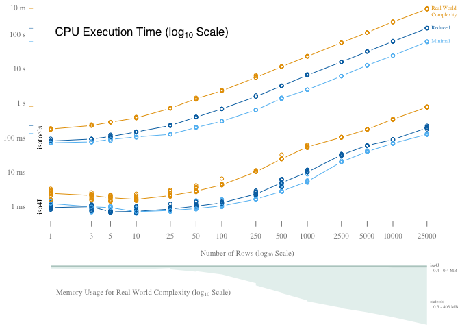
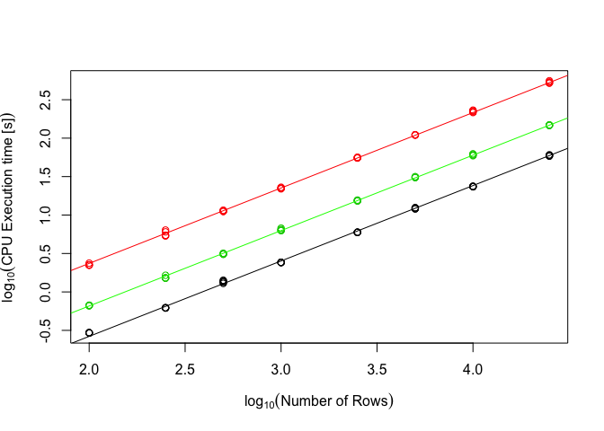
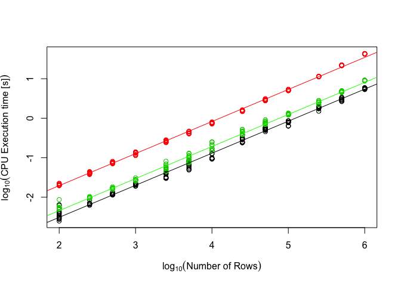
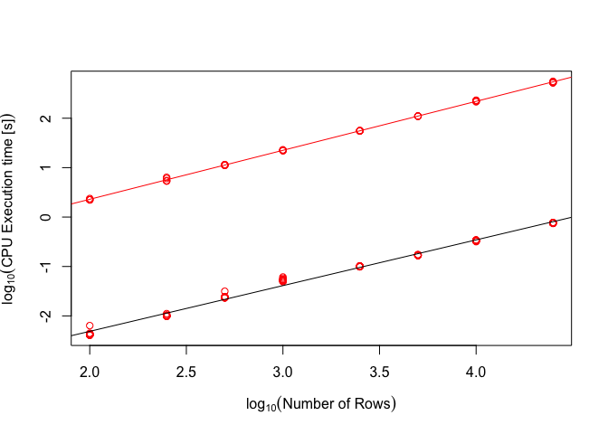

# Scalability Evaluation
{: .no_toc }

## Table of contents
{: .no_toc .text-delta }

1. TOC
{:toc}

Scalability of isa4j was assessed and compared to the python isatools API in two dimensions: number of entries and complexity of entries.

At the simplest complexity (*minimum*) rows consisted only of a Source connected to a Sample through a Process in the Study File, and that Sample connected to a DataFile through another Process in the Assay File, with no Characteristics, Comments, or other additional Information.
At the second level of complexity (*reduced*), a Characteristic was added to the Sample in the Study File, and the Assay File was expanded to Sample->Process->Material->Process->DataFile.
The third and final level of complexity (*real world*) was modelled after the real-world metadata published for a plant phenotyping experiment that conform to the MIAPPE v1.1 data standard ([link](https://dx.doi.org/10.5447/IPK/2020/3)).
Examplary ISA-Tab output for each of the three complexity levels can be found in the following section.

For each complexity level, CPU execution time was measured for writing a number of $n$ rows in Study and Assay File each, starting at 1 row and increasing stepwise up to 25,000 rows.
Every combination of complexity level and $n$ was measured for 5 consecutive runs (15 for isa4j because results varied more) after a warm-up of writing 100 rows.
Additionally, memory usage was measured for realistic complexity in 5 separate runs after CPU execution time measurements.

Performance evaluation was carried out on a Macbook Pro 2017 (2.3 GHz Dual-Core Intel Core i5 Processor, 16 GB 2133 MHz LPDDR3 RAM) with macOS Catalina (Version 10.15.2).
isatools was evaluated under Python 3.7.3 [Clang 11.0.0 (clang-1100.0.33.16)] using isatools version 0.11 and memory-profiler version 0.57 for measuring RAM usage. CPU execution time was measured with `time.process_time_ns`. 
isa4j was evaluated under AdoptOpenJDK 11.0.5 using `ThreadMXBean.getCurrentThreadCpuTime()` and `MemoryMXBean.getHeapMemory().getUsed()`.
For both platform, memory consumption baseline was calculated after the warm-up runs and an additional GC invocation.
This baseline consumption was subtracted from all subsequent memory consumption values (we wanted to measure purely the memory consumed by the ISA-Tab content, not libraries and other periphery).

The actual code generating the files and measuring time and memory usage can be found [here](https://github.com/IPK-BIT/isa4j/blob/master/src/test/resources/de/ipk_gatersleben/bit/bi/isa4j/performanceTests/isatools_performance_test.py) for python isatools and [here](https://github.com/IPK-BIT/isa4j/blob/master/src/test/java/de/ipk_gatersleben/bit/bi/isa4j/performanceTests/PerformanceTester.java) for isa4j

## Complexity Levels

Here you can see what the output generated for the different complexity level looks like.
It is identical between isa4j and python isatools.

### Minimal

Study File:

|Source Name       |Protocol REF      |Sample Name       |
|:-----------------|:-----------------|:-----------------|
|source_material-0 |sample collection |sample_material-0 |
|source_material-1 |sample collection |sample_material-1 |
|source_material-2 |sample collection |sample_material-2 |
|source_material-3 |sample collection |sample_material-3 |

Assay File:

|Sample Name       |Protocol REF        |Raw Data File    |
|:-----------------|:-------------------|:----------------|
|sample_material-0 |material sequencing |sequenced-data-0 |
|sample_material-1 |material sequencing |sequenced-data-1 |
|sample_material-2 |material sequencing |sequenced-data-2 |
|sample_material-3 |material sequencing |sequenced-data-3 |

### Reduced

Study File:

|Source Name       |Protocol REF      |Sample Name       |Characteristics[Organism] |Term Source REF |Term Accession Number                               |
|:-----------------|:-----------------|:-----------------|:-------------------------|:---------------|:---------------------------------------------------|
|source_material-0 |sample collection |sample_material-0 |Homo Sapiens              |NCBITaxon       |http://purl.bioontology.org/ontology/NCBITAXON/9606 |
|source_material-1 |sample collection |sample_material-1 |Homo Sapiens              |NCBITaxon       |http://purl.bioontology.org/ontology/NCBITAXON/9606 |
|source_material-2 |sample collection |sample_material-2 |Homo Sapiens              |NCBITaxon       |http://purl.bioontology.org/ontology/NCBITAXON/9606 |
|source_material-3 |sample collection |sample_material-3 |Homo Sapiens              |NCBITaxon       |http://purl.bioontology.org/ontology/NCBITAXON/9606 |

Assay File:

|Sample Name       |Protocol REF |Extract Name |Protocol REF |Raw Data File    |
|:-----------------|:------------|:------------|:------------|:----------------|
|sample_material-0 |extraction   |extract-0    |sequencing   |sequenced-data-0 |
|sample_material-1 |extraction   |extract-1    |sequencing   |sequenced-data-1 |
|sample_material-2 |extraction   |extract-2    |sequencing   |sequenced-data-2 |
|sample_material-3 |extraction   |extract-3    |sequencing   |sequenced-data-3 |

### Real World

Study File:

|Source Name |Characteristics[Organism] |Term Source REF |Term Accession Number                         |Characteristics[Genus] |Term Source REF |Term Accession Number                         |Characteristics[Species] |Characteristics[Infraspecific Name] | Characteristics[Biological Material Latitude]| Characteristics[Biological Material Longitude]|Characteristics[Material Source ID]                                                |Characteristics[Seed Origin]                    |Characteristics[Growth Facility] | Characteristics[Material Source Latitude]| Characteristics[Material Source Longitude]|Protocol REF |Parameter Value[Rooting medium]                                                   |Parameter Value[Container type] |Term Source REF |Term Accession Number                        | Parameter Value[Container volume]|Unit  |Term Source REF |Term Accession Number                     | Parameter Value[Container height]|Unit |Term Source REF |Term Accession Number                     | Parameter Value[Number of plants per containers]| Parameter Value[pH]| Parameter Value[Air temperature Day - Stratification]|Unit |Term Source REF |Term Accession Number                     | Parameter Value[Air temperature Night - Stratification]|Unit |Term Source REF |Term Accession Number                     | Parameter Value[Average length of the light period - Stratification]|Unit |Term Source REF |Term Accession Number                     | Parameter Value[Light intensity - Stratification]|Unit         | Parameter Value[Fraction of outside light intercepted by growth facility components and surrounding structures - Stratification]|Parameter Value[Type of lamps used]                                                                    | Parameter Value[Average relative humidity during the light period - Stratification]|Unit |Term Source REF |Term Accession Number                     | Parameter Value[Average relative humidity during the dark period - Stratification]|Unit |Term Source REF |Term Accession Number                     | Parameter Value[Air temperature Day - Germination]|Unit |Term Source REF |Term Accession Number                     | Parameter Value[Air temperature Night - Germination]|Unit |Term Source REF |Term Accession Number                     | Parameter Value[Average length of the light period - Germination]|Unit |Term Source REF |Term Accession Number                     | Parameter Value[Light intensity - Germination]|Unit         | Parameter Value[Fraction of outside light intercepted by growth facility components and surrounding structures - Germination]| Parameter Value[Average relative humidity during the light period - Germination]|Unit |Term Source REF |Term Accession Number                     | Parameter Value[Average relative humidity during the dark period - Germination]|Unit |Term Source REF |Term Accession Number                     | Parameter Value[Air temperature Day - Post Germination]|Unit |Term Source REF |Term Accession Number                     | Parameter Value[Air temperature Night - Post Germination]|Unit |Term Source REF |Term Accession Number                     | Parameter Value[Average length of the light period - Post Germination]|Unit |Term Source REF |Term Accession Number                     | Parameter Value[Light intensity - Post Germination]|Unit         | Parameter Value[Fraction of outside light intercepted by growth facility components and surrounding structures - Post Germination]| Parameter Value[Average relative humidity during the light period - Post Germination]|Unit |Term Source REF |Term Accession Number                     | Parameter Value[Average relative humidity during the dark period - Post Germination]|Unit |Term Source REF |Term Accession Number                     |Parameter Value[Watering regimen]                                    |Parameter Value[Composition of nutrient solutions used for irrigation] |Sample Name |Characteristics[Observation Unit Type] |Factor Value[Soil Cover] |Factor Value[Plant Movement] |
|:-----------|:-------------------------|:---------------|:---------------------------------------------|:----------------------|:---------------|:---------------------------------------------|:------------------------|:-----------------------------------|---------------------------------------------:|----------------------------------------------:|:----------------------------------------------------------------------------------|:-----------------------------------------------|:--------------------------------|-----------------------------------------:|------------------------------------------:|:------------|:---------------------------------------------------------------------------------|:-------------------------------|:---------------|:--------------------------------------------|---------------------------------:|:-----|:---------------|:-----------------------------------------|---------------------------------:|:----|:---------------|:-----------------------------------------|------------------------------------------------:|-------------------:|-----------------------------------------------------:|:----|:---------------|:-----------------------------------------|-------------------------------------------------------:|:----|:---------------|:-----------------------------------------|--------------------------------------------------------------------:|:----|:---------------|:-----------------------------------------|-------------------------------------------------:|:------------|--------------------------------------------------------------------------------------------------------------------------------:|:------------------------------------------------------------------------------------------------------|-----------------------------------------------------------------------------------:|:----|:---------------|:-----------------------------------------|----------------------------------------------------------------------------------:|:----|:---------------|:-----------------------------------------|--------------------------------------------------:|:----|:---------------|:-----------------------------------------|----------------------------------------------------:|:----|:---------------|:-----------------------------------------|-----------------------------------------------------------------:|:----|:---------------|:-----------------------------------------|----------------------------------------------:|:------------|-----------------------------------------------------------------------------------------------------------------------------:|--------------------------------------------------------------------------------:|:----|:---------------|:-----------------------------------------|-------------------------------------------------------------------------------:|:----|:---------------|:-----------------------------------------|-------------------------------------------------------:|:----|:---------------|:-----------------------------------------|---------------------------------------------------------:|:----|:---------------|:-----------------------------------------|----------------------------------------------------------------------:|:----|:---------------|:-----------------------------------------|---------------------------------------------------:|:------------|----------------------------------------------------------------------------------------------------------------------------------:|-------------------------------------------------------------------------------------:|:----|:---------------|:-----------------------------------------|------------------------------------------------------------------------------------:|:----|:---------------|:-----------------------------------------|:--------------------------------------------------------------------|:----------------------------------------------------------------------|:-----------|:--------------------------------------|:------------------------|:----------------------------|
|Plant_0     |Arabidopsis thaliana      |NCBITaxon       |http://purl.obolibrary.org/obo/NCBITaxon_3702 |Arabidopsis            |NCBITaxon       |http://purl.obolibrary.org/obo/NCBITaxon_3701 |thaliana                 |NA                                  |                                      51.82772|                                       11.27778|http://eurisco.ipk-gatersleben.de/apex/f?p=103:16:::NO::P16_EURISCO_ACC_ID:1668187 |http://arabidopsis.info/StockInfo?NASC_id=22680 |small LemnaTec phytochamber      |                                  51.82772|                                   11.27778|Growth       |85% (v) red substrate 1 (Klasmann-Deilmann GmbH, Geeste, Germany) / 15% (v) sand) |pot                             |AGRO            |http://purl.obolibrary.org/obo/AGRO_00000309 |                              0.43|litre |UO              |http://purl.obolibrary.org/obo/UO_0000099 |                              0.08|m    |UO              |http://purl.obolibrary.org/obo/UO_0000008 |                                                1|                 5.5|                                                     5|s    |UO              |http://purl.obolibrary.org/obo/UO_0000027 |                                                       5|°C   |UO              |http://purl.obolibrary.org/obo/UO_0000027 |                                                                   24|h    |UO              |http://purl.obolibrary.org/obo/UO_0000032 |                                                 0|µmol m-2 s-1 |                                                                                                                                0|Whitelux Plus metal halide lamps (Venture Lighting Europe Ltd., Rickmansworth, Hertfordshire, England) |                                                                                  90|%    |UO              |http://purl.obolibrary.org/obo/UO_0000187 |                                                                                 90|%    |UO              |http://purl.obolibrary.org/obo/UO_0000187 |                                                 16|°C   |UO              |http://purl.obolibrary.org/obo/UO_0000027 |                                                   14|°C   |UO              |http://purl.obolibrary.org/obo/UO_0000027 |                                                                16|h    |UO              |http://purl.obolibrary.org/obo/UO_0000032 |                                            140|µmol m-2 s-1 |                                                                                                                             0|                                                                               75|%    |UO              |http://purl.obolibrary.org/obo/UO_0000187 |                                                                              75|%    |UO              |http://purl.obolibrary.org/obo/UO_0000187 |                                                      20|°C   |UO              |http://purl.obolibrary.org/obo/UO_0000027 |                                                        18|°C   |UO              |http://purl.obolibrary.org/obo/UO_0000027 |                                                                     16|h    |UO              |http://purl.obolibrary.org/obo/UO_0000032 |                                                 140|µmol m-2 s-1 |                                                                                                                                  0|                                                                                    60|%    |UO              |http://purl.obolibrary.org/obo/UO_0000187 |                                                                                   60|%    |UO              |http://purl.obolibrary.org/obo/UO_0000187 |initial watering before germination from bottom, then top irrigation |water                                                                  |1135FA-0    |plant                                  |covered                  |rotating                     |
|Plant_1     |Arabidopsis thaliana      |NCBITaxon       |http://purl.obolibrary.org/obo/NCBITaxon_3702 |Arabidopsis            |NCBITaxon       |http://purl.obolibrary.org/obo/NCBITaxon_3701 |thaliana                 |NA                                  |                                      51.82772|                                       11.27778|http://eurisco.ipk-gatersleben.de/apex/f?p=103:16:::NO::P16_EURISCO_ACC_ID:1668187 |http://arabidopsis.info/StockInfo?NASC_id=22680 |small LemnaTec phytochamber      |                                  51.82772|                                   11.27778|Growth       |85% (v) red substrate 1 (Klasmann-Deilmann GmbH, Geeste, Germany) / 15% (v) sand) |pot                             |AGRO            |http://purl.obolibrary.org/obo/AGRO_00000309 |                              0.43|litre |UO              |http://purl.obolibrary.org/obo/UO_0000099 |                              0.08|m    |UO              |http://purl.obolibrary.org/obo/UO_0000008 |                                                1|                 5.5|                                                     5|s    |UO              |http://purl.obolibrary.org/obo/UO_0000027 |                                                       5|°C   |UO              |http://purl.obolibrary.org/obo/UO_0000027 |                                                                   24|h    |UO              |http://purl.obolibrary.org/obo/UO_0000032 |                                                 0|µmol m-2 s-1 |                                                                                                                                0|Whitelux Plus metal halide lamps (Venture Lighting Europe Ltd., Rickmansworth, Hertfordshire, England) |                                                                                  90|%    |UO              |http://purl.obolibrary.org/obo/UO_0000187 |                                                                                 90|%    |UO              |http://purl.obolibrary.org/obo/UO_0000187 |                                                 16|°C   |UO              |http://purl.obolibrary.org/obo/UO_0000027 |                                                   14|°C   |UO              |http://purl.obolibrary.org/obo/UO_0000027 |                                                                16|h    |UO              |http://purl.obolibrary.org/obo/UO_0000032 |                                            140|µmol m-2 s-1 |                                                                                                                             0|                                                                               75|%    |UO              |http://purl.obolibrary.org/obo/UO_0000187 |                                                                              75|%    |UO              |http://purl.obolibrary.org/obo/UO_0000187 |                                                      20|°C   |UO              |http://purl.obolibrary.org/obo/UO_0000027 |                                                        18|°C   |UO              |http://purl.obolibrary.org/obo/UO_0000027 |                                                                     16|h    |UO              |http://purl.obolibrary.org/obo/UO_0000032 |                                                 140|µmol m-2 s-1 |                                                                                                                                  0|                                                                                    60|%    |UO              |http://purl.obolibrary.org/obo/UO_0000187 |                                                                                   60|%    |UO              |http://purl.obolibrary.org/obo/UO_0000187 |initial watering before germination from bottom, then top irrigation |water                                                                  |1135FA-1    |plant                                  |uncovered                |stationary                   |
|Plant_2     |Arabidopsis thaliana      |NCBITaxon       |http://purl.obolibrary.org/obo/NCBITaxon_3702 |Arabidopsis            |NCBITaxon       |http://purl.obolibrary.org/obo/NCBITaxon_3701 |thaliana                 |NA                                  |                                      51.82772|                                       11.27778|http://eurisco.ipk-gatersleben.de/apex/f?p=103:16:::NO::P16_EURISCO_ACC_ID:1668187 |http://arabidopsis.info/StockInfo?NASC_id=22680 |small LemnaTec phytochamber      |                                  51.82772|                                   11.27778|Growth       |85% (v) red substrate 1 (Klasmann-Deilmann GmbH, Geeste, Germany) / 15% (v) sand) |pot                             |AGRO            |http://purl.obolibrary.org/obo/AGRO_00000309 |                              0.43|litre |UO              |http://purl.obolibrary.org/obo/UO_0000099 |                              0.08|m    |UO              |http://purl.obolibrary.org/obo/UO_0000008 |                                                1|                 5.5|                                                     5|s    |UO              |http://purl.obolibrary.org/obo/UO_0000027 |                                                       5|°C   |UO              |http://purl.obolibrary.org/obo/UO_0000027 |                                                                   24|h    |UO              |http://purl.obolibrary.org/obo/UO_0000032 |                                                 0|µmol m-2 s-1 |                                                                                                                                0|Whitelux Plus metal halide lamps (Venture Lighting Europe Ltd., Rickmansworth, Hertfordshire, England) |                                                                                  90|%    |UO              |http://purl.obolibrary.org/obo/UO_0000187 |                                                                                 90|%    |UO              |http://purl.obolibrary.org/obo/UO_0000187 |                                                 16|°C   |UO              |http://purl.obolibrary.org/obo/UO_0000027 |                                                   14|°C   |UO              |http://purl.obolibrary.org/obo/UO_0000027 |                                                                16|h    |UO              |http://purl.obolibrary.org/obo/UO_0000032 |                                            140|µmol m-2 s-1 |                                                                                                                             0|                                                                               75|%    |UO              |http://purl.obolibrary.org/obo/UO_0000187 |                                                                              75|%    |UO              |http://purl.obolibrary.org/obo/UO_0000187 |                                                      20|°C   |UO              |http://purl.obolibrary.org/obo/UO_0000027 |                                                        18|°C   |UO              |http://purl.obolibrary.org/obo/UO_0000027 |                                                                     16|h    |UO              |http://purl.obolibrary.org/obo/UO_0000032 |                                                 140|µmol m-2 s-1 |                                                                                                                                  0|                                                                                    60|%    |UO              |http://purl.obolibrary.org/obo/UO_0000187 |                                                                                   60|%    |UO              |http://purl.obolibrary.org/obo/UO_0000187 |initial watering before germination from bottom, then top irrigation |water                                                                  |1135FA-2    |plant                                  |covered                  |rotating                     |
|Plant_3     |Arabidopsis thaliana      |NCBITaxon       |http://purl.obolibrary.org/obo/NCBITaxon_3702 |Arabidopsis            |NCBITaxon       |http://purl.obolibrary.org/obo/NCBITaxon_3701 |thaliana                 |NA                                  |                                      51.82772|                                       11.27778|http://eurisco.ipk-gatersleben.de/apex/f?p=103:16:::NO::P16_EURISCO_ACC_ID:1668187 |http://arabidopsis.info/StockInfo?NASC_id=22680 |small LemnaTec phytochamber      |                                  51.82772|                                   11.27778|Growth       |85% (v) red substrate 1 (Klasmann-Deilmann GmbH, Geeste, Germany) / 15% (v) sand) |pot                             |AGRO            |http://purl.obolibrary.org/obo/AGRO_00000309 |                              0.43|litre |UO              |http://purl.obolibrary.org/obo/UO_0000099 |                              0.08|m    |UO              |http://purl.obolibrary.org/obo/UO_0000008 |                                                1|                 5.5|                                                     5|s    |UO              |http://purl.obolibrary.org/obo/UO_0000027 |                                                       5|°C   |UO              |http://purl.obolibrary.org/obo/UO_0000027 |                                                                   24|h    |UO              |http://purl.obolibrary.org/obo/UO_0000032 |                                                 0|µmol m-2 s-1 |                                                                                                                                0|Whitelux Plus metal halide lamps (Venture Lighting Europe Ltd., Rickmansworth, Hertfordshire, England) |                                                                                  90|%    |UO              |http://purl.obolibrary.org/obo/UO_0000187 |                                                                                 90|%    |UO              |http://purl.obolibrary.org/obo/UO_0000187 |                                                 16|°C   |UO              |http://purl.obolibrary.org/obo/UO_0000027 |                                                   14|°C   |UO              |http://purl.obolibrary.org/obo/UO_0000027 |                                                                16|h    |UO              |http://purl.obolibrary.org/obo/UO_0000032 |                                            140|µmol m-2 s-1 |                                                                                                                             0|                                                                               75|%    |UO              |http://purl.obolibrary.org/obo/UO_0000187 |                                                                              75|%    |UO              |http://purl.obolibrary.org/obo/UO_0000187 |                                                      20|°C   |UO              |http://purl.obolibrary.org/obo/UO_0000027 |                                                        18|°C   |UO              |http://purl.obolibrary.org/obo/UO_0000027 |                                                                     16|h    |UO              |http://purl.obolibrary.org/obo/UO_0000032 |                                                 140|µmol m-2 s-1 |                                                                                                                                  0|                                                                                    60|%    |UO              |http://purl.obolibrary.org/obo/UO_0000187 |                                                                                   60|%    |UO              |http://purl.obolibrary.org/obo/UO_0000187 |initial watering before germination from bottom, then top irrigation |water                                                                  |1135FA-3    |plant                                  |uncovered                |stationary                   |

Assay File:

|Sample Name |Protocol REF |Parameter Value[Imaging Time] |Parameter Value[Camera Configuration] |Parameter Value[Camera Sensor] |Parameter Value[Camera View] | Parameter Value[Imaging Angle]|Unit   |Term Source REF |Term Accession Number                     |Derived Data File            |Comment[Image analysis tool] |
|:-----------|:------------|:-----------------------------|:-------------------------------------|:------------------------------|:----------------------------|------------------------------:|:------|:---------------|:-----------------------------------------|:----------------------------|:----------------------------|
|1135FA-0    |Phenotyping  |28.09.2011 12:34:37           |A_Fluo_Side_Big_Plant                 |FLUO                           |side                         |                             90|degree |UO              |http://purl.obolibrary.org/obo/UO_0000185 |derived_data_files/das_0.txt |IAP                          |
|1135FA-1    |Phenotyping  |28.09.2011 12:34:37           |A_Fluo_Side_Big_Plant                 |FLUO                           |side                         |                             90|degree |UO              |http://purl.obolibrary.org/obo/UO_0000185 |derived_data_files/das_1.txt |IAP                          |
|1135FA-2    |Phenotyping  |28.09.2011 12:34:37           |A_Fluo_Side_Big_Plant                 |FLUO                           |side                         |                             90|degree |UO              |http://purl.obolibrary.org/obo/UO_0000185 |derived_data_files/das_2.txt |IAP                          |
|1135FA-3    |Phenotyping  |28.09.2011 12:34:37           |A_Fluo_Side_Big_Plant                 |FLUO                           |side                         |                             90|degree |UO              |http://purl.obolibrary.org/obo/UO_0000185 |derived_data_files/das_3.txt |IAP                          |

## Results

The raw results can be found [here](https://ipk-bit.github.io/isa4j/performance_data.csv) if you want to perform your own analyses.


```r
data = read.csv("performance_data.csv")
data[data$memory.usage.in.mb == -1,]$memory.usage.in.mb = NA # Where RAM usage was not measured it was set to -1
data$time.in.ns.log = log(data$time.in.ns/1e+9, 10)
data$n.rows.log     = log(data$n.rows, 10)
data$memory.usage.in.kb.log = log(data$memory.usage.in.mb*1024, 10) # convert to KB so all transformed values are above 0
```

This is the visualization that is also part of the paper:


```r
data$color = "black"
data[data$row.complexity == "real_world",]$color = "#e69f00"
data[data$row.complexity == "reduced",]$color = "#0072b2"
data[data$row.complexity == "minimal",]$color = "#61BEF3" #56B4E9
col.gray = "gray52"
col.green.dark = "#B8CDC8" #DBF3ED 
col.green.light = "#E7F1EF" #EEF8F6 

#pdf("figure.pdf", 6.92913, 3.4, colormodel="srgb")
par(family="serif", cex=0.7, mar=c(4.5,3.8,0,0), fig=c(0,1,0.2,1))
xlim = c(0, 6.4)
plot(data$time.in.ns.log ~ data$n.rows.log, xlim=xlim, col=data$color, axes=F, xlab=expression("Number of Rows (log"[10]~"Scale)"), ylab="", col.lab=col.gray)
axis(1, col=F, col.tick=col.gray, at=log(c(1,3,5,10,25,50,100,250,500,1000,2500,5000,10000,25000,50000,100000,250000,500000,1000000), 10), labels=c(1,3,5,10,25,50,100,250,500,"1k","2.5k","5k","10k","25k","50k","100k","250k","500k","1 Mio"), col.axis=col.gray)
axis(2, las=2, at=c(seq(-3,2), log(600,10), log(3600,10), log(28800,10)), labels=c("1 ms","10 ms", "100 ms", "1 s", "10 s", "100 s", "10 m", "1 h", "8 h"), col=F, col.axis=col.gray)

text(0, 4, expression("CPU Execution Time (log"[10]~"Scale)"), pos=4, cex=1.5, family="sans")
mtext("isatools", side=2, at=-0.7, line=-1, cex=0.7)
mtext("isa4j", side=2, at=-2.5, line=-1, cex=0.7)
mtext("|", side=2, at=max(data[data$platform == "isatools" & data$row.complexity == "real_world",]$time.in.ns.log), col="#e69f00", cex=0.5)
mtext("|", side=2, at=max(data[data$platform == "isatools" & data$row.complexity == "reduced",]$time.in.ns.log), col="#0072b2", cex=0.5)
mtext("|", side=2, at=max(data[data$platform == "isatools" & data$row.complexity == "minimal",]$time.in.ns.log), col="#61BEF3", cex=0.5)
mtext("|", side=2, at=max(data[data$platform == "isa4J" & data$row.complexity == "real_world",]$time.in.ns.log), col="#e69f00", cex=0.5)
mtext("|", side=2, at=max(data[data$platform == "isa4J" & data$row.complexity == "reduced",]$time.in.ns.log), col="#0072b2", cex=0.5)
mtext("|", side=2, at=max(data[data$platform == "isa4J" & data$row.complexity == "minimal",]$time.in.ns.log), col="#61BEF3", cex=0.5)

sub = data[data$row.complexity == "real_world" & data$platform == "isatools",]
t = tapply(sub$time.in.ns.log, sub$n.rows.log, FUN=median)
lines(as.numeric(names(t)), t, col="#e69f00", type="b")
text(max(sub$n.rows.log), max(sub$time.in.ns.log), "Real World", pos=4, col="#e69f00", cex=0.7)
text(max(sub$n.rows.log), max(sub$time.in.ns.log)-0.23, "Complexity", pos=4, col="#e69f00", cex=0.7)

sub = data[data$row.complexity == "reduced" & data$platform == "isatools",]
t = tapply(sub$time.in.ns.log, sub$n.rows.log, FUN=median)
lines(as.numeric(names(t)), t, col="#0072b2", type="b")
text(max(sub$n.rows.log), max(sub$time.in.ns.log), "Reduced", pos=4, col="#0072b2", cex=0.7)

sub = data[data$row.complexity == "minimal" & data$platform == "isatools",]
t = tapply(sub$time.in.ns.log, sub$n.rows.log, FUN=median)
lines(as.numeric(names(t)), t, col="#61BEF3", type="b")
text(max(sub$n.rows.log), max(sub$time.in.ns.log), "Minimal", pos=4, col="#61BEF3", cex=0.7)

sub = data[data$row.complexity == "real_world" & data$platform == "isa4J",]
t = tapply(sub$time.in.ns.log, sub$n.rows.log, FUN=median)
lines(as.numeric(names(t)), t, col="#e69f00", type="b")

sub = data[data$row.complexity == "reduced" & data$platform == "isa4J",]
t = tapply(sub$time.in.ns.log, sub$n.rows.log, FUN=median)
lines(as.numeric(names(t)), t, col="#0072b2", type="b")

sub = data[data$row.complexity == "minimal" & data$platform == "isa4J",]
t = tapply(sub$time.in.ns.log, sub$n.rows.log, FUN=median)
lines(as.numeric(names(t)), t, col="#61BEF3", type="b")

# Memory Plot
par(fig=c(0,1,0,0.2), mar=c(0.2,3.8,0,0), new=T)
memSub = data[data$row.complexity == "real_world",]

memSub.isatools = memSub[memSub$platform == "isatools",]
memSub.isa4J = memSub[memSub$platform == "isa4J",]

memSub.isatools.medians = aggregate(memSub.isatools$memory.usage.in.kb.log, by=list(memSub.isatools$n.rows), FUN=median)
memSub.isa4J.medians = aggregate(memSub.isa4J$memory.usage.in.kb.log, by=list(memSub.isa4J$n.rows), FUN=median)

plot(-memSub$memory.usage.in.kb.log ~ memSub$n.rows.log, type="n", axes=F, xlim=xlim, xlab="", ylab="")


polygon(
  c(log(memSub.isatools.medians$Group.1, 10), max(log(memSub.isatools.medians$Group.1, 10)), min(log(memSub.isatools.medians$Group.1, 10))),
  -c(memSub.isatools.medians$x, min(memSub$memory.usage.in.kb.log), min(memSub$memory.usage.in.kb.log) ),
  col=col.green.light, border=NA) #DBF3ED

polygon(
  c(log(memSub.isa4J.medians$Group.1, 10), max(log(memSub.isa4J.medians$Group.1, 10)), min(log(memSub.isa4J.medians$Group.1, 10))),
  -c(memSub.isa4J.medians$x, min(memSub$memory.usage.in.kb.log), min(memSub$memory.usage.in.kb.log) ),
  col=col.green.dark, border=NA) #A1D7CA

text(0.01, -5.3, expression("Memory Usage for Real World Complexity (log"[10]~"Scale)"), pos=4, col=col.gray)

#text(0, 0.4, "isa4J", pos=2, xpd=NA, col=col.gray, cex=0.8)
#text(0, -1.6, "isatools", pos=2, xpd=NA, col=col.gray, cex=0.8)

text(log(1000000,10), -2.5, paste("isa4j \n  ",round(10^min(memSub.isa4J.medians$x)/1024, 1), "-", round(10^max(memSub.isa4J.medians$x)/1024, 1),"MB"), pos=4, xpd=NA, col=col.gray, cex=0.6)

text(log(1000000,10), -5.3, paste("isatools \n  ", round(10^min(memSub.isatools.medians$x)/1024, 1), " MB -\n  ", round(10^max(memSub.isatools.medians$x)/1024/1024, 1),"GB"), pos=4, xpd=NA, col=col.gray, cex=0.6)
```

<!-- -->

```r
#dev.off()
```

### Regression Models

To make quantitative statements about scalability it can be helpful to fit some regression models.

#### python isatools

It appears that the python isatools curves all become pretty linear after 100 rows and they all seem to be parallel, so we can fit a simple regression model without interaction term.


```r
sub = data[data$platform == "isatools" & data$n.rows >= 100,]
plot(sub$time.in.ns.log ~ sub$n.rows.log, col=sub$row.complexity, xlab=expression("log"[10]("Number of Rows")), ylab=expression("log"[10]("CPU Execution time [s]")))
model.isatools = lm(time.in.ns.log ~ n.rows.log + row.complexity, data=sub)
abline(model.isatools)
abline(model.isatools$coefficients[1]+model.isatools$coefficients[4], model.isatools$coefficients[2], col="green")
abline(model.isatools$coefficients[1]+model.isatools$coefficients[3], model.isatools$coefficients[2], col="red")
```

<!-- -->

```r
summary(model.isatools)
```

```
## 
## Call:
## lm(formula = time.in.ns.log ~ n.rows.log + row.complexity, data = sub)
## 
## Residuals:
##       Min        1Q    Median        3Q       Max 
## -0.018671 -0.008867 -0.002369  0.006046  0.149223 
## 
## Coefficients:
##                            Estimate Std. Error t value Pr(>|t|)    
## (Intercept)              -2.3695999  0.0042764  -554.1   <2e-16 ***
## n.rows.log                0.9850514  0.0009361  1052.3   <2e-16 ***
## row.complexityreal_world  0.9412709  0.0028597   329.2   <2e-16 ***
## row.complexityreduced     0.3942198  0.0028485   138.4   <2e-16 ***
## ---
## Signif. codes:  0 '***' 0.001 '**' 0.01 '*' 0.05 '.' 0.1 ' ' 1
## 
## Residual standard error: 0.01624 on 190 degrees of freedom
## Multiple R-squared:  0.9998,	Adjusted R-squared:  0.9998 
## F-statistic: 4.038e+05 on 3 and 190 DF,  p-value: < 2.2e-16
```

Looks pretty good! What can we learn from it? 

- Increasing the number of rows 10-fold will increase the required CPU execution time $10^{0.9850514} = 9.6616523$ -fold
- Increasing the complexity from minimal to reduced increases execution time $10^{0.3942198} = 2.478676$ -fold and increasing the complexity from minimal to real world increases it $10^{0.9412709} = 8.7351616$ -fold

#### isa4j

Now let's repeat the same analyses for the isa4j performance data.
We will again assume linearity and parallel lines for more than 100 rows.


```r
sub = data[data$platform == "isa4J" & data$n.rows >= 100,]
plot(sub$time.in.ns.log ~ sub$n.rows.log, col=sub$row.complexity, xlab=expression("log"[10]("Number of Rows")), ylab=expression("log"[10]("CPU Execution time [s]")))
model.isa4J = lm(time.in.ns.log ~ n.rows.log + row.complexity, data=sub)
abline(model.isa4J)
abline(model.isa4J$coefficients[1]+model.isa4J$coefficients[4], model.isa4J$coefficients[2], col="green")
abline(model.isa4J$coefficients[1]+model.isa4J$coefficients[3], model.isa4J$coefficients[2], col="red")
```

<!-- -->

```r
summary(model.isa4J)
```

```
## 
## Call:
## lm(formula = time.in.ns.log ~ n.rows.log + row.complexity, data = sub)
## 
## Residuals:
##      Min       1Q   Median       3Q      Max 
## -0.17913 -0.02842  0.00477  0.03270  0.32036 
## 
## Coefficients:
##                           Estimate Std. Error t value Pr(>|t|)    
## (Intercept)              -4.133611   0.009329 -443.08   <2e-16 ***
## n.rows.log                0.811649   0.002041  397.72   <2e-16 ***
## row.complexityreal_world  0.802811   0.006229  128.88   <2e-16 ***
## row.complexityreduced     0.169827   0.006229   27.26   <2e-16 ***
## ---
## Signif. codes:  0 '***' 0.001 '**' 0.01 '*' 0.05 '.' 0.1 ' ' 1
## 
## Residual standard error: 0.06151 on 581 degrees of freedom
## Multiple R-squared:  0.9967,	Adjusted R-squared:  0.9967 
## F-statistic: 5.888e+04 on 3 and 581 DF,  p-value: < 2.2e-16
```

This model does not fit as well as the isatools one because there is a lot more variation in the data and there appear some points where the curve is not perfectly linear (for example, Java translates JVM code into native machine code after a certain number of repititions).
For simplicity's sake we will accept the model though and assume it is good enough for our purposes.

So, same calculations like above:

- Increasing the number of rows 10-fold will increase the required CPU execution time $10^{0.8116486} = 6.4810982$ -fold
- Increasing the complexity from minimal to reduced increases execution time $10^{0.1698272} = 1.47852$ -fold and increasing the complexity from minimal to real world increases it $10^{0.8028115} = 6.3505519$ -fold

We can see that isa4j scales slightly better with number of rows and significantly better at increasing complexity of rows.

#### Direct Comparison

Now let's try a direct comparison of both libraries for real world complexity.
The slopes are not the same so we need an interaction term here.


```r
sub = data[data$row.complexity == "real_world" & data$n.rows >= 100,]
plot(sub$time.in.ns.log ~ sub$n.rows.log, col=sub$row.complexity, xlab=expression("log"[10]("Number of Rows")), ylab=expression("log"[10]("CPU Execution time [s]")))
model.both = lm(time.in.ns.log ~ n.rows.log * platform, data=sub)
abline(model.both)
abline(model.both$coefficients[1]+model.both$coefficients[3], model.both$coefficients[2]+model.both$coefficients[4], col="red")
```

<!-- -->

```r
summary(model.both)
```

```
## 
## Call:
## lm(formula = time.in.ns.log ~ n.rows.log * platform, data = sub)
## 
## Residuals:
##       Min        1Q    Median        3Q       Max 
## -0.072842 -0.023789 -0.002461  0.021472  0.080930 
## 
## Coefficients:
##                              Estimate Std. Error t value Pr(>|t|)    
## (Intercept)                 -3.363660   0.008204 -410.01   <2e-16 ***
## n.rows.log                   0.819803   0.001945  421.51   <2e-16 ***
## platformisatools             1.914702   0.016463  116.30   <2e-16 ***
## n.rows.log:platformisatools  0.170395   0.003918   43.49   <2e-16 ***
## ---
## Signif. codes:  0 '***' 0.001 '**' 0.01 '*' 0.05 '.' 0.1 ' ' 1
## 
## Residual standard error: 0.03385 on 255 degrees of freedom
## Multiple R-squared:  0.9995,	Adjusted R-squared:  0.9995 
## F-statistic: 1.808e+05 on 3 and 255 DF,  p-value: < 2.2e-16
```

OK, the models look good enough, now we can make actual comparisons.
Since the slopes of the lines are different, isa4j is going to become relatively faster the more rows we write:

- When writing 100 lines isa4j is $10^{1.9147021 + 0.1703948 * log_{10}(100)} = 180.0909175$ faster
- When writing 25000 lines isa4j is $10^{1.9147021 + 0.1703948 * log_{10}(25000)} = 461.4115139$ faster

## Conclusion

There are two take-aways from this:

1. isa4j scales significantly better when complexity of rows increases (1.47852 and 6.3505519-fold increase for isa4j compared to 2.478676 and 8.7351616-fold for isatools).
2. The more lines are written, the faster isa4j becomes compared to isatools (180.0909175 faster for 100 lines, 461.4115139 faster for 25,00 lines).
